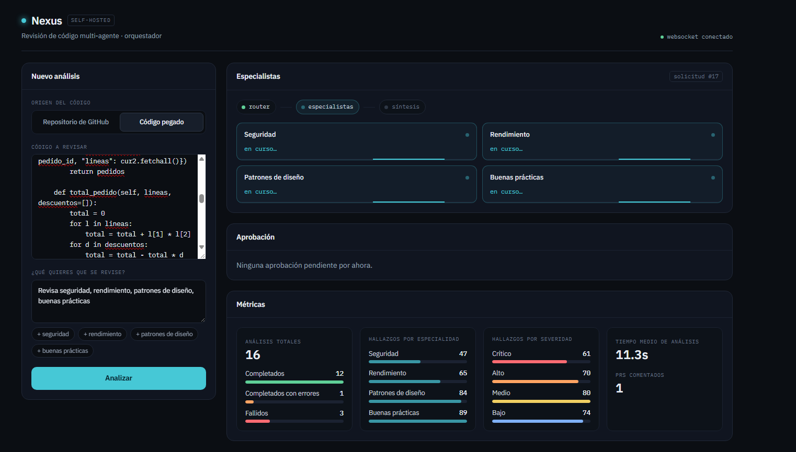
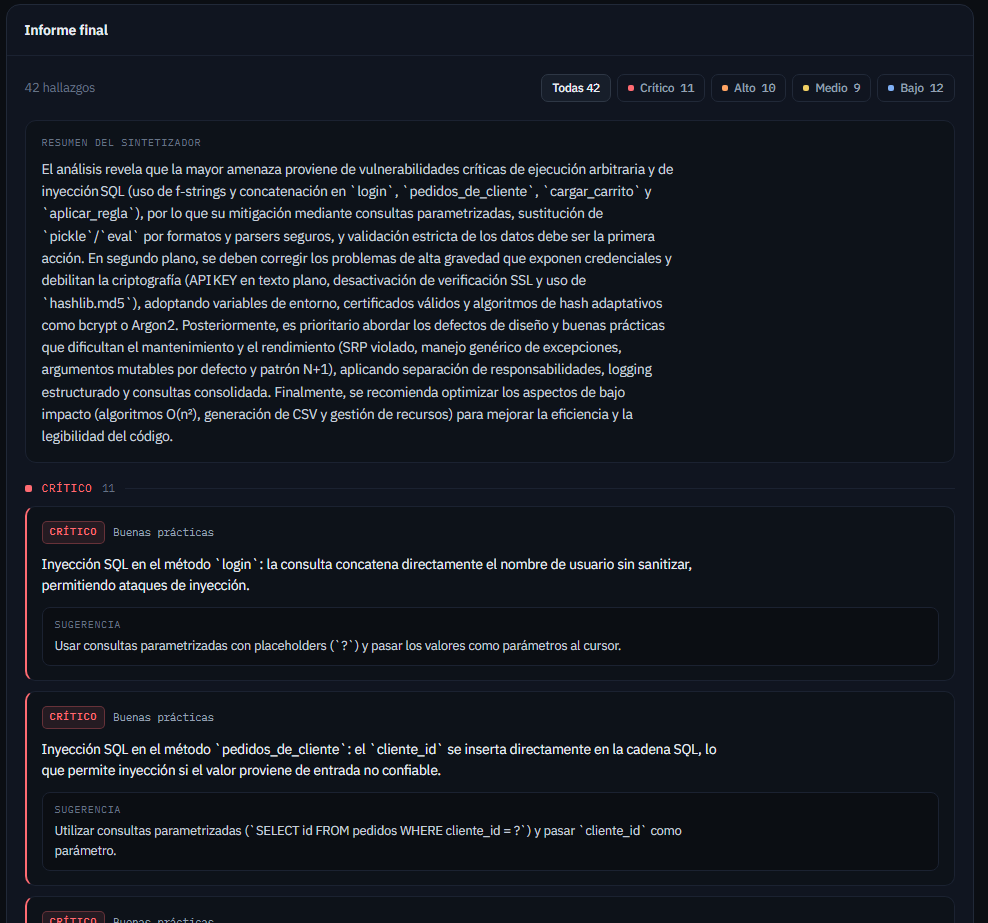

# Nexus


**Revisión de código con agentes especialistas.** Le das un repositorio de GitHub o pegas código, le dices qué quieres que mire, y un grafo de LangGraph lanza en paralelo solo los especialistas que hacen falta: seguridad, rendimiento, patrones de diseño y buenas prácticas. Un Synthesizer junta sus hallazgos en un informe. Si pides que lo publique en un pull request, el grafo se para y espera tu aprobación antes de escribir nada en GitHub.



## Arrancar

Hace falta Docker y rellenar tres valores en `backend/.env`:

```bash
cp backend/.env.example backend/.env
docker compose up --build
```

- `GROQ_API_KEY`: una clave de [Groq](https://console.groq.com/keys), que es donde corren los modelos.
- `GITHUB_TOKEN`: un token personal de GitHub con permiso para leer repos y comentar en pull requests.
- `MCP_API_KEY`: cualquier cadena secreta. Protege las llamadas del backend al servidor MCP.

Eso levanta cinco servicios: `postgres`, `redis`, `backend` (API en **[http://localhost:8000/docs](http://localhost:8000/docs)**, aplica las migraciones al arrancar), `mcp_server` (puerto 8001) y `frontend` (dashboard en **[http://localhost:3000](http://localhost:3000)**).

`NEXT_PUBLIC_API_URL` se incrusta en el frontend al construir la imagen. Si el backend no va a estar en `localhost:8000`, cámbiala en `frontend.build.args` de `docker-compose.yml` y reconstruye.

## Cómo funciona


**1. Entrada.** Si le das un repo, `entry_node` lo lee a través del servidor MCP. Este paso no usa ningún modelo.

**2. Router.** Un LLM (`openai/gpt-oss-20b` en Groq) lee lo que pediste y devuelve qué especialistas hacen falta, contra un esquema Pydantic cerrado (`RouterDecision`). La arista siguiente usa `Send()` de LangGraph: solo arrancan los elegidos, y a la vez.

**3. Especialistas.** Cada uno (`openai/gpt-oss-120b`) devuelve sus hallazgos con una severidad (`critical`, `high`, `medium` o `low`) y los guarda en Postgres en cuanto termina.

**4. Synthesizer.** Junta todo en un informe: una lista completa hecha en Python y, encima, un resumen del LLM (ver más abajo por qué).



**5. Aprobación y comentario.** Si marcaste que se publique en el PR, `human_approval_node` pausa el grafo con `interrupt()`. El estado queda guardado en Redis, y el grafo se reanuda cuando apruebas o rechazas desde el dashboard. Solo entonces `post_comment_node` publica el comentario.

**El servidor MCP** es un servicio aparte (FastMCP, puerto 8001) con tres herramientas: `read_repository_files`, `get_pr_diff` y `post_pr_comment`. El grafo lo llama autenticándose con `MCP_API_KEY`, y el `GITHUB_TOKEN` solo se usa dentro de su cliente de GitHub: nunca llega a un prompt.

**La traza en vivo.** El runner recorre el grafo con `graph.astream(stream_mode="updates")` y convierte cada paso en un evento que llega al dashboard por WebSocket, sin tener que instrumentar cada nodo.

## Las decisiones que importan


### El LLM no decide si se publica en el PR

Comentar en un pull request es público y no se deshace con facilidad. Por eso `post_to_pr` es un campo que marcas tú al crear el análisis, y el Router no puede activarlo: su esquema ni siquiera tiene ese campo. Además, `post_to_pr` exige un repo de GitHub y un número de PR, porque publicar en un PR real el análisis de un código pegado confundiría a quien lo lea después.

### La lista de hallazgos la hace Python; el resumen, el LLM

El informe tiene dos partes. Abajo, una sección generada en Python con todos los hallazgos ordenados por severidad, que está completa por construcción. Encima, un resumen de tres a cinco frases que escribe el LLM para relacionar hallazgos y priorizar. Si el modelo se deja algo al resumir, la lista sigue ahí entera.

### Si cae un especialista, los demás siguen

Un especialista que falla (por ejemplo, por el límite de peticiones de Groq) no toca el campo `error` del estado, que es el que detiene el grafo. Se apunta en `failed_specialists`, que tiene su propio reducer porque pueden escribir varios a la vez, el informe se monta con lo que sí terminó y el análisis acaba como `completed_with_errors` en lugar de `failed`. Con el comentario en el PR pasa lo mismo: si falla, la revisión ya estaba hecha y no se marca como fallida.

### El repo se descarga entero, en dos peticiones

Pedir cada fichero a la API de GitHub cuesta una petición por fichero, y en un repo de cientos de ficheros se acaba el límite. `read_repository_files` descarga el zipball y filtra en memoria: dos peticiones, sea cual sea el tamaño del repo. Solo entra código (sin `node_modules`, `.git`, `venv`, `dist` ni `build`), con un máximo de 100 KB por fichero y 500 KB en total, porque todo acaba dentro del prompt de los especialistas.

## Lo que salió mal por el camino

- **Un estado que no cabía en su columna.** `completed_with_errors` tiene 22 caracteres y la columna `status` era `String(20)`, así que Postgres rechazaba la actualización. Lo cazaron los tests, y la migración `f744bdb8f237` la ensanchó a 30.
- **Tests que habrían llamado a Groq y a GitHub.** El `TestClient` de Starlette ejecuta las `BackgroundTasks` dentro de la propia petición, así que cualquier test que creara un análisis habría lanzado el grafo real. El fixture `client` de `tests/api/conftest.py` cambia el grafo por uno simulado.
- **Alembic propuso un orden que Postgres no acepta.** Al retirar el dominio de tickets (ver abajo), `--autogenerate` borraba la tabla `tickets` antes de quitar la clave foránea que apuntaba a ella. La migración `f9bab08a7d00` se reordenó a mano: primero la clave y luego la tabla, y al revés en el `downgrade`. Desde entonces cada migración generada se revisa antes de aplicarla.


## De gestor de tickets a revisor de código

Nexus empezó como un gestor genérico de tickets de soporte: clasificar el ticket, buscar en una base de conocimiento, diagnosticar y escalar. Funcionaba, pero era una cadena fija de pasos, y el sistema externo al que escalaba era una tabla simulada.

El 29 de julio lo cambié a revisión de código, porque ahí los agentes tienen trabajo que repartirse: varios especialistas mirando el mismo código a la vez, un número de agentes que el Router decide en cada petición y una integración real con GitHub. Reutilicé la infraestructura, el servidor MCP como base y la aprobación humana; los nodos, los modelos de datos y las herramientas se reescribieron, y el dominio de tickets se borró entero para no arrastrar código muerto. Por eso los primeros commits hablan de tickets.

## Calidad

- **178 tests de backend** con pytest, contra Postgres y Redis reales (`redis-stack-server`, porque el checkpointer de LangGraph necesita RediSearch), y **70 de frontend** con Vitest y Testing Library. Los LLM y la API de GitHub están simulados: ningún test sale a la red.
- **CI en cada push** (`[ci.yml](.github/workflows/ci.yml)`): aplica las migraciones como prueba de humo, pasa ruff, corre la suite y falla si la cobertura baja del 95%. El frontend pasa `tsc`, ESLint y Vitest.
- Un test sube, baja y vuelve a subir todas las migraciones (`tests/test_alembic_migrations.py`).


## Limitaciones conocidas

- **El análisis es siempre sobre el repo entero, no sobre el diff del PR.** `get_pr_diff` está en el servidor MCP, pero todavía no la usa ningún nodo.
- **Un repo grande se analiza en parte**: al llegar a 500 KB de código se deja de leer.
- **Con los límites de peticiones de Groq**, cuatro especialistas a la vez pueden toparse con ellos. Cuando pasa, el especialista aparece como fallido en el informe.
- **El tiempo medio de análisis de las métricas es una aproximación**: sale de `created_at` y `updated_at`, porque no hay una columna `completed_at`.


## Desarrollo

Postgres y Redis con Docker; backend, servidor MCP y frontend en local con recarga en caliente (Python 3.13 y pnpm):

```bash
docker compose up postgres redis

# desde backend/, en dos terminales
uvicorn app.main:app --reload          # API en http://localhost:8000/docs
python -m app.mcp_server.server        # servidor MCP

# desde frontend/
pnpm dev                               # dashboard en http://localhost:3000
```

Copia `backend/.env.example` a `backend/.env` y `frontend/.env.example` a `frontend/.env.local`. Los tests: `pytest -v --cov=app` en `backend/` y `pnpm test` en `frontend/`.

## Stack

Python 3.13 · FastAPI · LangGraph con checkpointer en Redis (`langgraph-checkpoint-redis`) · FastMCP · Groq (`openai/gpt-oss-20b` para el Router, `openai/gpt-oss-120b` para los especialistas) · PostgreSQL 16 con SQLAlchemy y Alembic · httpx contra la API de GitHub · Next.js 16, React 19, TypeScript y Tailwind 4 · WebSockets · pytest, Vitest, ruff y GitHub Actions · Docker Compose.

## Licencia

[MIT](LICENSE).